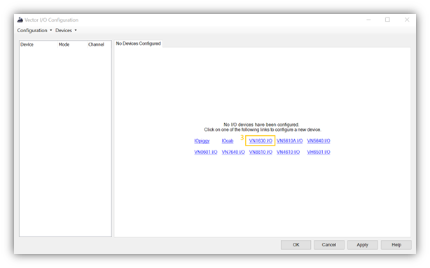

# how to use VN HW IO piggy in automotive testing

## hardware and software required

* VN HW with IO piggy.
* example VN1630A HW.
* Vector CANoe software.
* DB9 Male connector.
* 12v relay (GoodSky relay 1 pc ~30 rupees) for controlling Digital out. Required only for loads more than 500ma.
* Banana connectors. Reuired only if your HW setup has feasibility.
* Power supply.

## Features of VN1630 IO

* 1 Analog input (Range 0V to 18V, 10 bit resolution, 1kHz sampling rate)
* 1 Digital Output (Open Drain, External supply up to 32V, Max current 500mA)
* 2 Digital Input (Range 0V to 32V, Schmitt trigger high 2.7V & low 2.2V)

## where can i find 🧐 vector IO hardware configuration and how to configure 👨‍🔧

* Open CANoe configuration
* go to Hardware 👉 Vector I/O 👉 VN1630 IO
* select Standard Mode 👉 OK

## Use below Highlighted auto generated system variables for Analysis and Controlling.

👉 verify IO: Environment 👉 System Variables 👉 System-Defined 👉 IO 👉 VN1600_1

## Hardware setup block diagram for using VN1630 Digital Out
